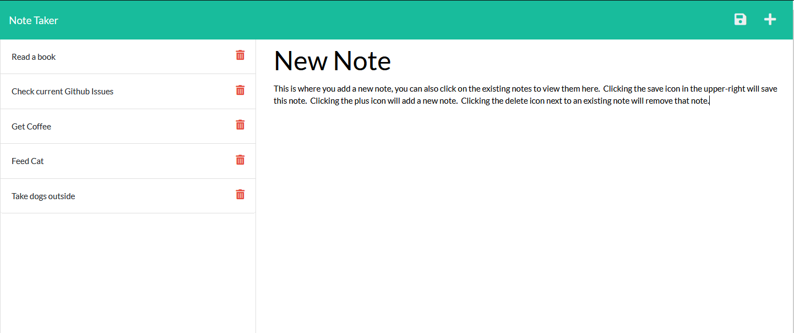

# Express Note Taker

## Description
 

This is an app that allows you to take notes, view notes, and delete notes, and saves them in a db.json file

Click below to see a live version of this app (note: this app is deployed on Heroku using free dynos, so it may take some time to start.)

---

## Table of Contents

[Installation](#Installation)

[Usage](#Usage)

[License](#License)

[Questions](#Questions)

---

## Installation

To install, clone the repository and run npm i

---

## Usage

To use the project, run npm start (or npm devstart if you would like to make changes and see them live) and open your browser to localhost:3001.  Alternatively, you can deploy this to Heroku.

---

## License

[ISC License](https://opensource.org/licenses/ISC)

---

## Questions?

For any questions, please visit my Github: [github.com/AaronMikelKey](https://github.com/AaronMikelKey)

or send me an email at [AaronMikelKey@gmail.com](mailto:AaronMikelKey@gmail.com)
